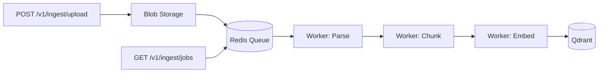

# RAG Ingest Endpoint Enhancement

3-stage async pipeline: **File Upload → Indexing → Vector DB**

---

## Decisions Locked In ✅

| Decision | Choice |
|----------|--------|
| Vector DB | **Qdrant** |
| Job Queue | **Redis** (via arq) |
| Processing | **Async** (background workers) |
| File types | TXT, MD, PDF, DOCX |
| Chunking (Phase 1) | Fixed-size (1000 chars, 100 overlap) |
| Chunking (Phase 2) | Add sentence-aware option |
| Embeddings (Phase 1) | all-MiniLM-L6-v2 (current) |
| Embeddings (Phase 3) | Dual: E5-large-v2 + nomic-embed-text |

---

## Embedding Model Clarification

> [!NOTE]
> **E5-large-v2 vs Ollama compatibility question:**

**E5-large-v2** runs via `sentence-transformers` (Python library), **not** Ollama. Here's the breakdown:

| Model | How to Run | Speed | Quality |
|-------|------------|-------|---------|
| all-MiniLM-L6-v2 | sentence-transformers | ~5ms/doc | Good |
| **E5-large-v2** | sentence-transformers | ~50-100ms/doc | Excellent |
| nomic-embed-text | Ollama (`ollama embeddings`) | ~20ms/doc | Very Good |

**"How much longer?"** - E5-large-v2 is roughly **10-20x slower** than MiniLM due to model size (1.3GB vs 90MB). For a 100-doc batch:
- MiniLM: ~0.5 seconds
- E5-large: ~5-10 seconds

**Dual-embedding strategy (Phase 3):**
- Index once with E5-large-v2 (high quality, offline)
- Index again with nomic-embed-text (fast, Ollama-native for real-time)
- Query can use either based on need (quality vs speed)

---

## Chunking Strategy Clarification

> [!TIP]
> **Sentence-aware now vs later?**

**Recommendation: Keep fixed-size for Phase 1.** Here's why:

| Approach | Pros | Cons |
|----------|------|------|
| Fixed-size (current) | Predictable, works | May split mid-sentence |
| Sentence-aware | Better semantic boundaries | Adds NLTK/spaCy dependency |

Your current chunking **works for MVP**. Sentence-aware is a Phase 2 enhancement after the core pipeline is solid. The overlap (100 chars) helps mitigate boundary issues anyway.

---

## Architecture



---

## Phase 1: Core Pipeline (MVP)

**Goal:** Async file upload → blob storage → process → Qdrant

### New Files

#### [NEW] `core/file_storage.py`
```python
class BlobStorage:
    """Manages files in data/preindex_blob/"""
    def save(file: UploadFile) -> str  # Returns blob_id
    def get(blob_id: str) -> Path
    def list() -> List[BlobInfo]
    def delete(blob_id: str) -> bool
```

#### [NEW] `rag/document_parser.py`
```python
class DocumentParser:
    """Extracts text from various formats"""
    def parse(filepath: Path) -> ParsedDocument
    def supports(extension: str) -> bool
    
# ParsedDocument = { text: str, metadata: dict, pages: int }
```

### Modified Files

#### [MODIFY] `app/routes/ingest.py`
Add endpoints:
- `POST /v1/ingest/upload` - Upload file, returns `job_id`
- `GET /v1/ingest/jobs/{job_id}` - Check job status
- `GET /v1/ingest/blobs` - List staged files
- `DELETE /v1/ingest/blobs/{blob_id}` - Remove file

#### [MODIFY] `pyproject.toml`
Add dependencies:
```toml
python-multipart = "^0.0.6"  # File uploads
pypdf2 = "^3.0.0"            # PDF parsing
python-docx = "^1.1.0"       # DOCX parsing
redis = "^5.0.0"             # Redis client
arq = "^0.26.0"              # Async Redis queue
```

### Redis Job Queue

Using `arq` (async Redis queue) for reliable job processing:

```python
# core/queue.py
from arq import create_pool
from arq.connections import RedisSettings

async def get_redis_pool():
    return await create_pool(RedisSettings(host='localhost'))

# Worker function
async def process_document(ctx, job_id: str, blob_id: str):
    # Parse → Chunk → Embed → Store in Qdrant
    ...
```

```python
# Endpoint enqueues job
@router.post("/ingest/upload")
async def upload_file(file: UploadFile):
    blob_id = blob_storage.save(file)
    job = await redis_pool.enqueue_job('process_document', blob_id)
    return {"job_id": job.job_id, "status": "queued"}
```

### Job Status (Redis)

Job status stored in Redis with TTL:
- `ingest:job:{job_id}` → `{status, blob_id, created_at, result}`
- Auto-expires after 24h (configurable)
- Query via `GET /v1/ingest/jobs/{job_id}`

---

## Phase 2: Document Parsing & Metadata

**Goal:** Rich metadata, better chunking

### Enhancements

1. **PDF parsing** with page numbers
2. **DOCX parsing** with section headers
3. **Metadata in Qdrant payloads:**
   ```json
   {
     "text": "...",
     "source_file": "report.pdf",
     "page": 5,
     "chunk_index": 12,
     "file_type": "pdf"
   }
   ```
4. **Sentence-aware chunking** (optional flag)

---

## Phase 3: Enhanced Embeddings

**Goal:** Dual-embedding for quality + speed

### Implementation

1. Add `embedding_model` config option
2. Support switching between:
   - `all-MiniLM-L6-v2` (default, fast)
   - `E5-large-v2` (quality, sentence-transformers)
   - `nomic-embed-text` (Ollama-native)
3. Dual-index option: create two collections with different embeddings
4. Query-time model selection

### Collection Naming
```
simrag_docs_minilm     # Fast queries
simrag_docs_e5large    # Quality queries
```

---

## Implementation Order

```mermaid
gantt
    title Implementation Phases
    dateFormat X
    axisFormat %s
    
    section Phase 1
    BlobStorage class      :1, 2
    Document parser (all types) :2, 4
    Upload endpoint        :3, 4
    Async job processing   :4, 6
    Job status tracking    :5, 6
    
    section Phase 2
    Metadata extraction    :7, 8
    Sentence-aware chunking :8, 9
    
    section Phase 3
    E5-large integration   :10, 11
    nomic-embed-text       :11, 12
    Dual-index support     :12, 13
```



---

## Verification Plan

### Phase 1 Testing
1. Upload `.txt` file → verify blob created
2. Check job status → verify `completed`
3. Query `/v1/query` → verify retrieval works
4. Upload `.pdf` → verify text extracted
5. Upload `.docx` → verify text extracted

### Phase 2 Testing
1. Verify metadata in Qdrant payloads
2. Test sentence-aware chunking toggle

### Phase 3 Testing
1. Compare retrieval quality: MiniLM vs E5
2. Benchmark embedding speed
3. Test dual-collection queries
